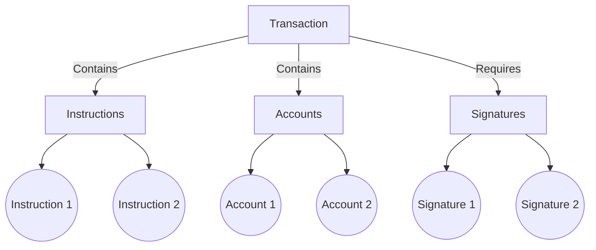
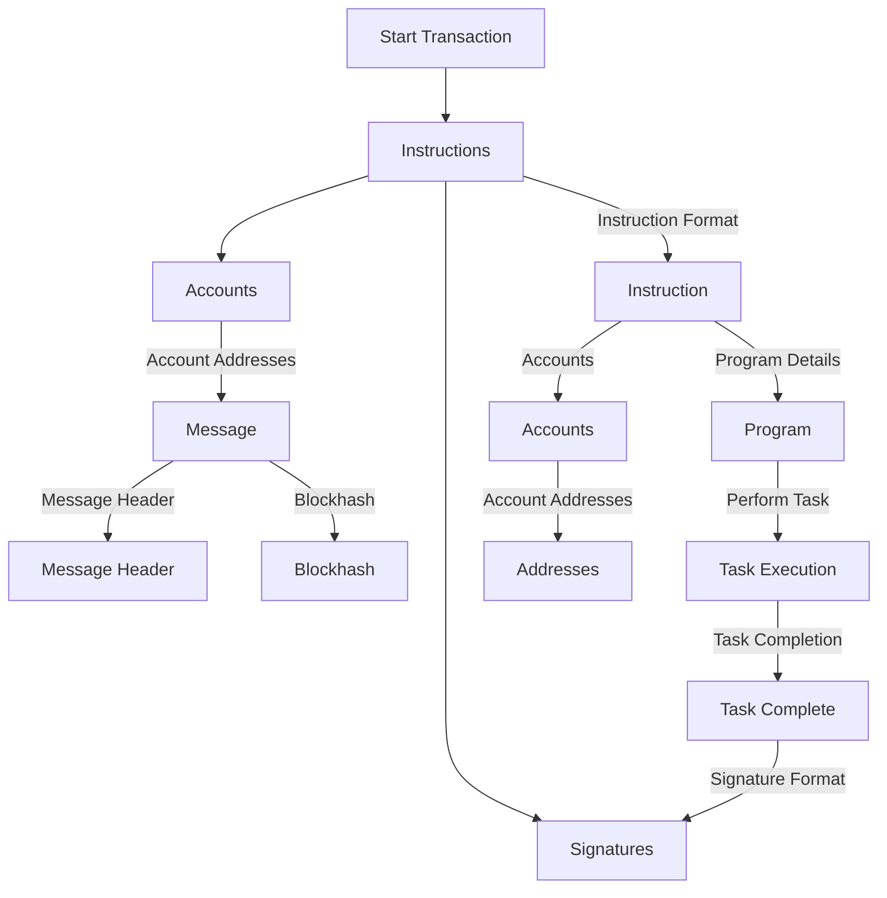

[Intro To Solana - Calyptus](https://calyptus.co/lessons/intro-to-solana/)

# Intro To Solana

##### October 10, 2023

## **A Brief History**

Solana is a high-performance blockchain platform that aims to provide fast, secure, and scalable decentralised applications (dApps) and cryptocurrencies. It was built to address the scalability limitations faced by existing blockchain networks, such as Bitcoin & Ethereum.

The blockchain was developed by a team of engineers led by Anatoly Yakovenko, a former Qualcomm engineer, and was officially launched in March 2020. The project gained significant attention due to its innovative approach to scalability and its ability to handle a large number of transactions per second (TPS).

When building on Solana, its native programming language is primarily Rust, a modern systems programming language known for its safety, speed, and concurrency. Recently-developed frameworks have opened doors for Solana smart contract development to be possible using Python and even Solidity.

**What Does Solana Have To Offer?**

When it comes to choosing a blockchain platform to build on, Solana offers several compelling features that make it an attractive option for developers and users alike.

**i) Speed & High Transaction Volume**

Solana is known for its speed and high-volume transaction processing capabilities. With its innovative architecture and consensus mechanisms, Solana can handle a remarkable number of transactions per second (TPS) up to 65,000 TPS, with an average daily usage of 4,000 TPS. This high throughput makes Solana well-suited for applications that require fast and efficient transaction processing, such as decentralised exchanges (DEXs), high-frequency trading, and gaming platforms.

**ii) A Large & Active Developer Community**

In addition to its high-volume capabilities, Solana also boasts a sizable and active developer community. The platform has attracted a wide range of developers who contribute to its ecosystem by building innovative applications, creating tools and libraries, and providing support to fellow developers. Its thriving community fosters collaboration, knowledge sharing, and continuous improvement within the Solana ecosystem.

**iii) Groundbreaking Innovations**

In terms of innovation, Solana has introduced several groundbreaking inventions that push the boundaries of what is possible on a blockchain. One notable example is the development of compressed non-fungible tokens (NFTs) which you’ll learn all about in the tutorial: **Build A Compressed NFT Airdropping Platform**!

CompressedNFTs allow for the storage and transfer of NFT data in a highly efficient manner compared to the NFTs seen so far, reducing storage costs and enhancing the overall scalability of NFT-based applications. This innovation opens up exciting possibilities for the future of digital collectables, gaming assets, and intellectual property rights management.

Check out the table below to see the difference by volume and cost:

Resource : [https://solana.com/news/state-compression-compressed-nfts-solana](https://solana.com/news/state-compression-compressed-nfts-solana)

**Unique factors**

One of the defining differences of Solana is its unique **time mechanism** called **Proof of History** (**PoH**). PoH provides a verifiable and permissionless source of time in the blockchain, enabling efficient parallel processing of transactions and increasing the network’s overall throughput.

Solana’s architecture is built around a combination of several cutting-edge technologies, including a **proof-of-stake (PoS) consensus** algorithm and a **tower Byzantine Fault Tolerance (BFT)** consensus mechanism. These features work together to ensure fast transaction confirmations, high scalability, and strong security.

**Proof of Stake**

As you might know, Bitcoin uses ‘Proof of Work’ for reaching consensus among the miners. Proof of Work involves miners competing to solve a computational puzzle through trial and error.

Despite every single miner exerting a huge amount of effort, there can only be one “winner” for each block, which means 99% of the energy used is attributed to the attempts of “losers”. This is where there has been controversy over Bitcoin’s efficiency and sustainability.

Solana however uses the **proof-of-stake consensus mechanism** to solve this efficiency problem.

Solana employs a unique leader rotation approach to manage validator roles within its cluster. The system operates with a single leader responsible for generating ledger entries at any given time, enabling all validators to replicate identical ledger copies. This single-leader model, while efficient, presents the risk of a malicious leader censoring votes and transactions. To counter this, the cluster pre defines a leader schedule for each epoch, assigning the leadership role to different nodes in a rotated manner.

Let’s understand it in a simple way:

1. **Leader Schedule Rotation and Rejecting Blocks:** Imagine a group of people who take turns leading a team. When it’s someone’s turn to lead, they create a special document. Other people in the team will only accept documents that are created by the designated leader for that turn.
2. **Changing Leaders and Identifying Them:** These leader turns are then planned ahead of time, like having a schedule for each day’s leader. This schedule is regularly updated to keep things fair. This way, everyone knows who should be in charge when.
3. **Making Sure Leaders Are Fair:** To prevent any unfair control, the time between updating the schedule and it becoming active is set according to the previous day’s plans. This helps avoid anyone trying to manipulate things for their benefit.
4. **Handling Complicated Situations:** Sometimes, there might be situations where things get a bit complicated, like having certain parts of the team working separately. In such cases, the time between updating the schedule is adjusted based on how long these complications last. This adjustment makes sure everyone is on the same page.
5. **Choosing Leaders Carefully:** When picking leaders, we use a special method. We have a list of team members, and we look at how much each member is contributing. The ones who contribute more have a better chance of being chosen as leaders. This approach helps protect the team from any attempts to harm the process.

By using this methodology, Solana ensures that the team works together smoothly, leaders are chosen fairly, and everyone is protected from any tricks or problems. This keeps the system running well and prevents any disruptions.

**Proof of History**

Proof of History (PoH) is a unique feature of the Solana blockchain. It acts as a clock that establishes a reliable and verifiable order of events. PoH generates timestamps for each transaction and action on the network, ensuring an accurate historical record. This enables nodes to quickly verify the chronological order of events, enabling parallel processing and improving scalability. 

In Solana’s implementation, **PoH and PoS work together** harmoniously. The PoH timestamps are used to enhance the security and efficiency of the PoS consensus. Validators can reference the PoH timestamps to ensure that the blocks they are validating are in the correct order, eliminating the need for additional consensus rounds. This integration of PoH and PoS enables Solana to achieve high transaction throughput, low latency, and overall scalability.

By combining PoH and PoS, Solana offers a robust & scalable blockchain platform suitable for a wide range of decentralised applications. Developers are able to build complex applications with seamless user experiences.

**Account Model**

Something that’s incredibly important to wrap your head around as a Solana dev:

> **Everything on Solana is an account!**

If you’re coming from another blockchain ecosystem then this might be difficult to first grasp but fear not, we delve into a complete practical understanding in the tutorial: **Create Your First Token**. So if you’re starting anywhere, we recommend you start on this project first.

Typically all your tokens in e.g. an Ethereum Wallet are stored in a single account. However, in Solana, **all the different tokens stored in your wallet ALL have their own accounts!** Try staying cognisant of this concept as you start to build applications.

And what is an **Account**? Well _an Account is a data structure which holds information of various kinds so it’s essentially the basic unit of storage on Solana_.

- So where do you store **data** such as texts on Solana? On an Account.
- Where do you store the **token balances** of a wallet? On an Account.
- Where do you deploy your **smart contracts**?

You guessed it, on an Account!

**Account Structure**:  Each account is represented by a **256-bits address**. An account can hold various types of data, including cryptocurrency balances, program code for smart contracts, and account-specific state information.

Usually on the other blockchains, both the logic and the state of a smart contract are stored together. For example, the ERC-20 contracts on Ethereum store logic (*e.g. transfer function*) and state (**user balances**) in a single account. But Solana is unique in this respect.

For any program on Solana, **the logic and the state are stored separately**.
- The account which holds the **logic of the program** is known as **_Program Account_**
- The accounts which hold the **state** are known as **_Data Accounts_**.

This unique architecture of logic-state separation makes Solana a highly performant blockchain. You will understand more about Accounts first-hand when you will go through some projects! As previously suggested, we advise starting with our Build Your First Token tutorial to get to grips with this concept.

**Solana Transactions: An Overview**

When things happen on the Solana blockchain, they start with a transaction. This is like a set of actions submitted to the network. Transactions include different tasks that need to be done, and these tasks are called instructions. Each transaction also needs signatures, which act like approvals to make sure things are authorised.

**Parts of a Transaction**

- **Instructions**: These are like the different tasks you want to do. They can include actions such as moving tokens from one account to another.
- **Accounts**: These are like the places where data is stored. Instructions use these accounts to perform actions.
- **Signatures**: These are like the green lights that say the transaction is okay. They show that the actions are authorised by the account holders.

**Details of a Transaction**

- **Signature Format**: Every transaction has one or more signatures that act as approvals.
- **Message Format**: A message is what’s inside a transaction. It has accounts, block information, and instructions.
- **Message Header**: This part of the message contains details like how many signatures are needed, how many accounts are read-only, and how many accounts don’t need signatures.
- **Account Addresses**: These are like the addresses of the places where data is stored. Some accounts are for reading, some for writing, and they’re organised in a specific way.
- **Blockhash**: This is like a special code that tells when a transaction happened. *If it’s too old, the network won’t accept it*.
- **Instruction Format**: An instruction is like a task for a program to do. It includes details about what program should do it and which accounts it should use.
- **Compact-Array Format**: This is a way to put a bunch of things together in a neat package.
- **Account Address Format**: An account address is like an ID for a place where data is stored.

**How Instructions Work**

Instructions are like tasks for programs. They tell the program what to do with which accounts. Programs read the data and accounts, do their job, and can either succeed or show an error.

**Putting Everything Together**

A Solana transaction has different parts: instructions for tasks, accounts to store data, signatures for approvals, and more. Each part is designed to make sure things are authorised and work properly. Solana’s structure helps keep everything organised and secure. Another important thing to consider is that the Solana transaction is atomic in nature so if one or more instructions fail, the whole transaction will fail.

**Solana Virtual Machine**

The last thing to understand is the Solana Virtual Machine (SVM) which is a high-performance execution engine that allows for parallel processing of smart contracts on the Solana blockchain. It is designed to support a large number of parallel threads, enabling fast and efficient execution of complex programs.

To take advantage of Solana’s high-performance network, they built the SVM, a hyper parallelized transaction processing engine designed to scale horizontally across GPUs and SSDs. Note that all other blockchains are single-threaded computers.

> _Solana was one of the first few chains to support parallel transaction execution (not just signature verification) in a single shard_.(A **shard** refers to a single processing unit that supports parallel transaction execution).

The solution to this problem borrows heavily from an operating system driver technique called scatter-gather. Transactions specify upfront what state they will read and write while executing.

The SVM is built on top of the Solana blockchain’s core technology, including the Account model and Proof of History consensus algorithm. It is optimised for parallel processing and can take advantage of multi-core processors, allowing it to execute multiple smart contract programs simultaneously.

The SVM also includes a number of other features that help to improve the performance and efficiency of smart contract execution on the Solana blockchain. For example, it includes a specialised memory allocator that reduces the overhead of memory allocation, and it uses a custom thread scheduler that can efficiently distribute work across multiple threads.

Overall, the SVM is a key component of the Solana blockchain’s design, enabling fast and efficient execution of decentralised applications. Its parallel processing capabilities help to make Solana one of the fastest and most scalable blockchain platforms available today.

**Done!**

Great work! You’ve just learnt about Solana from a bird’s eye view covering smart contracts, tokens & dApps. You’ve learnt about its powerful high-speed, low-cost nature through to its vibrant community, unique consensus mechanism (the SVM) and account model structure.

You’re almost ready to interact with the blockchain and start building your very first smart contract. Let’s first get you up to speed on Rust 101 and how to setup your local environment.