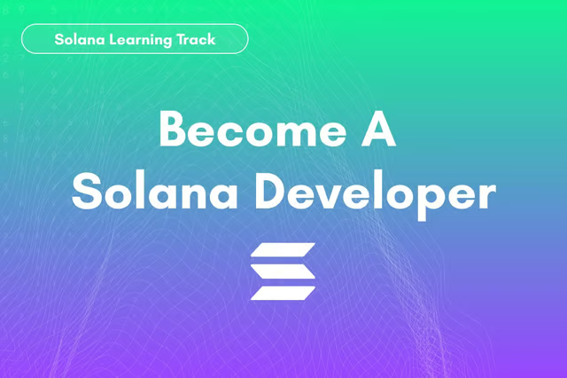

# Solana Learning Track

[Becoma A solana Developper](https://calyptus.co/learn-solana/)



## Playground (code & notes)

[**solana_calyptus/playground**](https://github.com/Laugharne/solana_calyptus/tree/main/playground)

## References & forks

| Lesson                                                                                   | GitHub (fork)                                                           | Description                                      |
| ---------------------------------------------------------------------------------------- | ----------------------------------------------------------------------- | ------------------------------------------------ |
| [Introduction To Rust](https://github.com/Laugharne/rust-101-for-solana#getting-started) | [rust-101-for-solana](https://github.com/Laugharne/rust-101-for-solana) | Introduction To Rust                             |
| [Create Your First Token](https://calyptus.co/lessons/creating-your-first-token/)        | [ts-token-solana](https://github.com/Laugharne/ts-token-solana)         | Minting Token on Solana using umi                |
| [Mint Your First NFT](https://calyptus.co/lessons/mint-your-first-nft/)                  | [solana-nft-anchor](https://github.com/Laugharne/solana-nft-anchor)     | Minting nfts on Solana using anchor and metaplex |


## Repository tree

```
.
├── 01 - Getting Started With Solana
│   ├── 01 - Blockchain 101.md
│   ├── 02 - Smart Contracts 101.md
│   ├── 03 - Intro To Solana.md
│   ├── 04 - Setting Up Your Local Environment.md
│   └── 05 - Introduction to Rust Programming.md
├── 02 - Creating Your First Token
│   └── 06 - Creating Your First Token.md
├── 03 - Mint Your First Token
│   └── 07 - Mint Your First Token.md
├── 2024-02-10-08-52-46.png
├── playground
│   ├── 01 - Getting Started With Solana
│   │   └── 04 - Setting Up Your Local Environment.md
│   └── 02 - Creating You First Token
│       ├── 06 - Creating Your First Token.md
│       └── ts-token-solana
└── README.md
```
