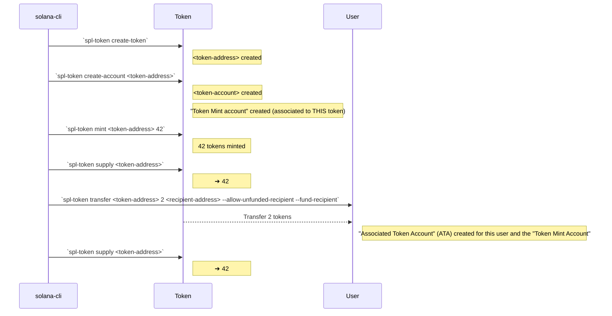
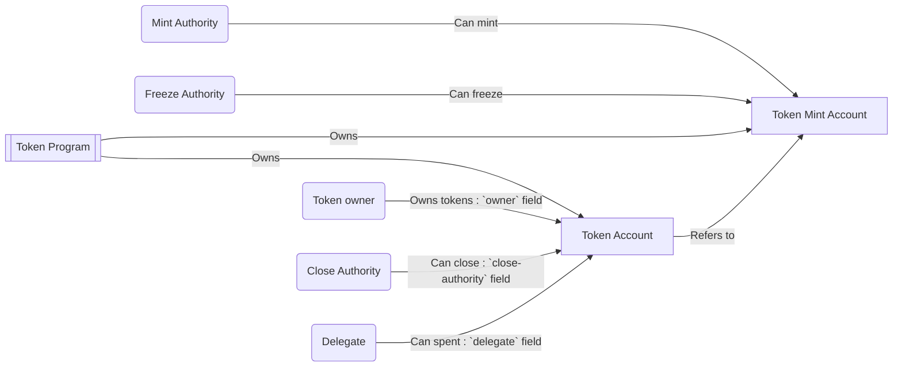

--------

### Résumé:


1. On imagine une monnaie : `spl-token create-token` (flag `--decimals XX` pour définir le nombre de décimal) ➜ `<token-address>`
2. On crée le compte (coffre ?) pour cette monnaie : `spl-token create-account <token-address>` ➜ `<token-account>`
3. On frappe la monnaie dans une certaine quantité : `spl-token mint <token-address> <amount-to-mint>` en ayant la possibilité de l'attribuer à un compte associé au même type de jeton (c'est-à-dire qu'il doit être lié au même "Token Mint Account") via `spl-token mint <token-address> <amount-to-mint> <user-token-account>` sinon les jetons seront émis mais resteront dans le "*Token Mint*" jusqu'à ce qu'ils soient attribués à un compte utilisateur à l'aide d'une commande de transfert ou d'une autre méthode d'attribution de jetons.
4. La commande `spl-token supply <token-address>` est utilisée pour interroger le nombre total de jetons en circulation d'un token spécifique ➜ `<token-amount>` nombre total de jetons en circulation.
5. `spl-token accounts` affiche une liste des comptes de jetons SPL associés à une adresse de portefeuille spécifique, en fournissant des détails tels que le type de jeton, le solde du compte, l'identifiant du compte et d'autres informations pertinentes. L'argument `<token-address>` Limite les résultats à un token donné. [Defaut: liste les comptes pour TOUS les tokens]
6. `spl-token transfer <token-address> <amount> <recipient-address> --allow-unfunded-recipient --fund-recipient` est utilisée pour transférer une quantité spécifique de jetons d'un compte à un autre sur la blockchain Solana. Les paramètres spécifient les détails du transfert.
    - `--allow-unfunded-recipient` : Facultatif. Il **permet de transférer des jetons à un destinataire qui n'a pas encore reçu de jetons** sur la blockchain Solana. Cela peut être utile si le destinataire n'a pas encore créé de compte pour le jeton spécifié.
    - `--fund-recipient` : Facultatif. Il indique au programme d'**envoyer** également une **petite quantité de SOL** au destinataire pour couvrir les **frais de transaction**. Nécessaire **si le destinataire n'a pas encore de SOL** sur son compte pour payer les frais de transaction.

--------

### Associated Token Account (ATA)

> Un "Associated Token Account" (ATA) sur la blockchain Solana est un **compte de portefeuille** qui est **automatiquement associé** à un **compte utilisateur** spécifique et qui est utilisé pour stocker un **type spécifique de jeton** (token).

> Lorsqu'un utilisateur détient des jetons sur Solana, **chaque type de jeton est associé à un compte spécifique appelé "Token Mint Account"**.

> Lorsqu'un utilisateur souhaite recevoir ou stocker des jetons d'un certain type, **un ATA est automatiquement créé** pour ce compte utilisateur, lié à ce "Token Mint Account".  

> Cela permet à l'utilisateur de gérer ses jetons de manière transparente sans avoir à créer manuellement des comptes pour chaque type de jeton.

> **En résumé, un ATA est un compte automatiquement créé pour stocker un type spécifique de jeton sur Solana**.

--------

### Diagramme

Ce diagramme représente le processus d'un Associated Token Account (ATA) sur la blockchain Solana. Lorsqu'un utilisateur détient des jetons, un ATA est automatiquement associé à son compte utilisateur et utilisé pour stocker les jetons. Chaque ATA est lié à un Token Mint spécifique, qui est le compte associé au type de jeton. L'ATA est automatiquement créé pour l'utilisateur lorsqu'il reçoit ou stocke des jetons, lui permettant de gérer ses jetons de manière transparente.



--------

### Comprendre "Mint Account" et "Token Account"

#### Séparation programmes/données

Avec Solana, les programmes ne contiennent pas de données, au lieu de cela elle possèdent des références sur des comptes ou elles sont sotckées.

Ce qui permet d'améliorer les performances car cela permet d'avoir des programmes s'éxécutant en parallèle, tant que ceux-ci n'accèdent pas en même temps aux même compte et données (account data)...

#### ERC-20 vs SPL Tokens

Il n'y a pas besoin de déployer un nouveau programme pour chaque nouveau token, comme c'est le cas avec le standard ERC-20. La fonctionalité d'un token est toujours la même, ce qui diffère ce sont les données associées à un token donné.

Ainsi les dévelopeurs de Solana ont inclus un programme [**(Token Program)**](https://spl.solana.com/token) standard déjà déployé et prêt à l'emploi que ce soir pour créer frapper (minter) échanger ou même détruire (burn) des tokens.

- Les ERC-20 ont une adresse unique, tandis que les SPL **font partie de l'architecture** de la blockchain Solana.
- Les SPL Tokens sont des **tokens décentralisés**, contrairement aux ERC-20 qui sont des contrats intelligents sur Ethereum. 

##### Autour du "Token Program"


Le **Token Program** qui se trouve être déjà déployé et près à l'usage pour tous.

**Token Mint Account** : Quand quelqu'un veut créer un nouveau token, il utilise la fonction `create-token` qui intialisera un nouveau "Mint Account" qui possédera les infomations de base sur ce token:
- `mint-authority` : clef publique (`pubkey`) autorisée à créer ce token (mint)
- `freeze-authority` : qui peut geler le compte du token
- Des données additionnelles comme :
  - L'approvisionnement `supply` qui est la quantité totale de jetons d'un type particulier qui ont été créés et qui sont en circulation sur la blockchain.
  - Le nombre de décimalss `decimals`
  - Un drapeau `isInitialized`
  - etc...

**Cycle de vie du "Token Mint Account"**

1. **Création du Compte "Token Mint Account"** : Avant de mettre en circulation des jetons, un compte Mint est créé à l'aide de la commande `spl-token create-token`. Cette commande permet de créer le compte Mint avec les spécifications nécessaires pour le jeton, telles que l'approvisionnement total, la précision décimale et d'autres propriétés.

2. **Configuration du Compte "Token Mint Account"** : Une fois le "Token Mint Account" créé, ses paramètres sont configurés à l'aide de la commande `spl-token set-metadata`. Cette commande permet de définir les caractéristiques du jeton, telles que l'approvisionnement total, la précision décimale et d'autres propriétés.

3. **Mise en circulation des Jetons** : Une fois que le "Token Mint Account" est établi et configuré, les jetons peuvent alors être mis en circulation en utilisant la commande `spl-token mint`. Cette commande permet de créer de nouveaux jetons en fonction des spécifications définies dans le compte Mint.

En résumé, les commandes `spl-token` sont utilisées pour créer le "Token Mint Account", le configurer et mettre en circulation les jetons en fonction de ses spécifications.

Pour le moment aucune données relatives à la possesion de ces tokens (par quelqu'un ou un compte) Car ces données sont stockées dans le `token-account`. 

Le **Token Account** possède les informations sur les tokens détenues par une `pubkey`.
Pour clarifier les relations d'appartenance entre ces différents types d'accounts :
- Le "Token Account" appartient au "Token Program" et le "Token Program" contrôle l'accès aux tokens au travers des champs `owner`, `close-authority` et `delegate` du `token-account`.
  - `owner` qui est la clef publique permattant de transférer/dépenser ce token.
  - `close-authority` possède les droits de fermer le compte
  - `owner` peut donner des droits à `delegate` (`pubkey`) pour dépenser une quantité `delegatedAmount` de tokens.
- Il existe également des flags comme `isInitialized`, `isFrozen`, `isNative`
- Par défaut les `token-account` sont initialisés (`initialized`) à la création et ne sont ni `frozen`, ni `native`.

Nous avons vu que le "Mint Account" définissait une `freeze-authority` qui a les droits de gelér l'usage des tokens d'un compte. Souvent la `freeze-authority` est à nul (que des zéros) et dans ce cas personne ne peut geler les tokens d'un `token-account`.  


##### Autour des "Accounts"

### Les différences entre un compte "Token Mint Account" et un compte "Associated Token Account (ATA)" ont les suivantes :

1. **Token Mint (Compte créateur de Jeton)** :
   - La "Token Mint Account" est le **compte responsable de l'émission** de nouveaux jetons d'une certaine catégorie sur la blockchain Solana.
   - Elle est **créée lorsqu'un jeton est créé** à l'aide de la commande `spl-token create-token`.
   - Le "Token Mint Account" détient les informations sur le jeton:
     - Type de jeton
     - Nombre total de jetons en circulation
     - Nombre de décimales
     - etc.
   - Les jetons sont créés et retirés du "Token Mint Account" en utilisant des commandes spécifiques comme `spl-token mint` et `spl-token burn`.

2. **Associated Token Account (ATA) (Compte Associé de Jeton)** :
   - Un "Associated Token Account" est un **compte de portefeuille** qui est automatiquement associé à un compte utilisateur spécifique sur la blockchain Solana pour stocker un type spécifique de jeton.
   - Il est **créé lorsqu'un utilisateur interagit** avec un certain type de jeton **pour la première fois**, par exemple lorsqu'il reçoit des jetons ou qu'il effectue une transaction avec eux.
   - Chaque ATA est associé à un "Token Mint Account" spécifique, ce qui signifie qu'il est **destiné à stocker uniquement** les jetons de **ce "Token Mint Account"**.
   - Les ATAs sont utilisés pour **suivre la possession et le transfert** de jetons par les utilisateurs sur la blockchain Solana.

--------

### Résumé commandes Solana & SPL-Token (cli)

#### Solana CLI (`solana`):
- `solana balance <adresse>` : Vérifie le solde d'un compte.
- `solana transfer <montant> <adresse destinataire>` : Transfère des SOL à une autre adresse.
- `solana airdrop <montant>` : Obtient des SOL gratuits sur un compte.
- `solana account <adresse>` : Affiche les informations sur un compte.
- `solana config get` : Affiche les paramètres de configuration actuels.
- `solana config set` : Configure les paramètres de configuration.
- `solana program deploy` : Déploie un programme sur la blockchain Solana.
- `solana program logs` : Affiche les journaux d'exécution d'un programme.

#### SPL Token CLI (`spl-token`):
- `spl-token create-token` : Crée un nouveau jeton.
- `spl-token mint <montant> <adresse>` : Crée de nouveaux jetons et les attribue à une adresse.
- `spl-token transfer <adresse source> <montant> <adresse destination>` : Transfère des jetons entre adresses.
- `spl-token approve <adresse dépensière> <montant>` : Approuve une adresse pour dépenser des jetons.
- `spl-token account <adresse>` : Affiche les informations sur un compte de jetons.

--------

### Metaplex

Metaplex est une infrastructure puissante (framework et plateforme) pour le développement d'écosystèmes NFTs sur la blockchain Solana, offrant des fonctionnalités avancées pour la création, la gestion et l'échange d'actifs numériques uniques et précieux.

Metaplex offre plusieurs fonctionnalités et composants essentiels pour le développement d'écosystèmes NFTs robustes sur Solana, notamment :

1. **Création d'actifs numériques** : Metaplex permet aux créateurs d'émettre et de mettre en vente des NFTs sur la blockchain Solana. Les utilisateurs peuvent créer des collections d'œuvres d'art numériques, de vidéos, de jeux, de produits virtuels et d'autres types d'actifs numériques uniques.

2. **Marchés décentralisés** : Metaplex propose des modèles de marchés décentralisés où les utilisateurs peuvent acheter, vendre et échanger des NFTs en toute sécurité et de manière transparente. Ces marchés permettent aux créateurs de monétiser leurs œuvres et aux collectionneurs d'explorer et d'acquérir des actifs numériques.

3. **Outils de développement** : Metaplex fournit des outils et des bibliothèques de développement pour faciliter la création d'applications et de services NFTs sur Solana. Les développeurs peuvent accéder à des API, des SDK et des composants prêts à l'emploi pour construire des expériences utilisateur personnalisées et innovantes.

4. **Interopérabilité** : Metaplex est conçu pour être compatible avec d'autres standards et protocoles NFTs, favorisant ainsi l'interopérabilité avec d'autres blockchains et écosystèmes numériques. Cela permet aux utilisateurs de déplacer et d'échanger leurs actifs numériques entre différentes plateformes et réseaux.

--------

### Liens

- [**Solana CLI Reference and Usage**](https://docs.solanalabs.com/cli/usage)
- [**Understanding Solana’s Mint Accounts and Token Accounts**](https://medium.com/@jorge_londono_31005/understanding-solanas-mint-account-and-token-accounts-546c0590e8e)

--------

--------

### Bash History

```bash
❯ solana address
2mcDUMsXbfzeiyr8cNd4XrTp2uwKySC6ujGmCVfBfQ3j


❯ solana balance
3 SOL


❯ solana balance 2mcDUMsXbfzeiyr8cNd4XrTp2uwKySC6ujGmCVfBfQ3j
3 SOL


❯ spl-token create-token --decimals 12
Creating token 8he38TiU21sguZJPhRT2dqjTi929hdfvsGUsVBXMG7Na under program TokenkegQfeZyiNwAJbNbGKPFXCWuBvf9Ss623VQ5DA

Address:  8he38TiU21sguZJPhRT2dqjTi929hdfvsGUsVBXMG7Na
Decimals:  12

Signature: 4Kxdw9YZTXwMMSdrcJEUDqJrkaLGA6h418auxfZzVBYpi7EBCMccT2giqcKVjogjG8ppCqhk867v42yizKTBh24J


❯ spl-token create-account 8he38TiU21sguZJPhRT2dqjTi929hdfvsGUsVBXMG7Na
Creating account 6pJ5LP3SJiNTgtSuZ5juM7aeJsrGTH3E3As5BALU5ZiB

Signature: 3cw2gjwyNeKrYBe17aevqeg2Pea2EAocPrWRrr5sBj8ufHrjhDjYHJCMpVayc5cbDGczje2m99hHawhKPrK2WEvL


❯ spl-token mint 8he38TiU21sguZJPhRT2dqjTi929hdfvsGUsVBXMG7Na 42
Minting 42 tokens
  Token: 8he38TiU21sguZJPhRT2dqjTi929hdfvsGUsVBXMG7Na
  Recipient: 6pJ5LP3SJiNTgtSuZ5juM7aeJsrGTH3E3As5BALU5ZiB

Signature: 3YG7BbzfaxRBZbRcPnjn75vKTLTriPt142RZ7Jmksf4Jt71jc4t2bspHbF3BNPbL6LWzCZhtf16nzq9fmbxKVniB


 ⏱ 4s
❯ spl-token supply 8he38TiU21sguZJPhRT2dqjTi929hdfvsGUsVBXMG7Na
42


❯ spl-token accounts
Token                                         Balance
-----------------------------------------------------
8he38TiU21sguZJPhRT2dqjTi929hdfvsGUsVBXMG7Na  42


❯ spl-token transfer 8he38TiU21sguZJPhRT2dqjTi929hdfvsGUsVBXMG7Na 2 2mcDUMsXbfzeiyr8cNd4XrTp2uwKySC6ujGmCVfBfQ3j --allow-unfunded-recipient --fund-recipient
Transfer 2 tokens
  Sender: 6pJ5LP3SJiNTgtSuZ5juM7aeJsrGTH3E3As5BALU5ZiB
  Recipient: 2mcDUMsXbfzeiyr8cNd4XrTp2uwKySC6ujGmCVfBfQ3j
  Recipient associated token account: 6pJ5LP3SJiNTgtSuZ5juM7aeJsrGTH3E3As5BALU5ZiB

Signature: 2WX1s3e18d7fVghX11mHn81ju57SxCAv6VVPDWZUU2jQjn6y2Xio22gAL5gwHuG91Ezjx6JTiytRWxE9SBQtb8ms


 ⏱ 2s
❯ solana balance
2.99647412 SOL


❯ spl-token supply 8he38TiU21sguZJPhRT2dqjTi929hdfvsGUsVBXMG7Na
42


❯ spl-token accounts
Token                                         Balance
-----------------------------------------------------
8he38TiU21sguZJPhRT2dqjTi929hdfvsGUsVBXMG7Na  42


❯ spl-token accounts 2mcDUMsXbfzeiyr8cNd4XrTp2uwKySC6ujGmCVfBfQ3j
Error: "Could not find mint account 2mcDUMsXbfzeiyr8cNd4XrTp2uwKySC6ujGmCVfBfQ3j"


❯ spl-token display 8he38TiU21sguZJPhRT2dqjTi929hdfvsGUsVBXMG7Na

SPL Token Mint
  Address: 8he38TiU21sguZJPhRT2dqjTi929hdfvsGUsVBXMG7Na
  Program: TokenkegQfeZyiNwAJbNbGKPFXCWuBvf9Ss623VQ5DA
  Supply: 42000000000000
  Decimals: 12
  Mint authority: 2mcDUMsXbfzeiyr8cNd4XrTp2uwKySC6ujGmCVfBfQ3j
  Freeze authority: (not set)


❯ spl-token display 6pJ5LP3SJiNTgtSuZ5juM7aeJsrGTH3E3As5BALU5ZiB

SPL Token Account
  Address: 6pJ5LP3SJiNTgtSuZ5juM7aeJsrGTH3E3As5BALU5ZiB
  Program: TokenkegQfeZyiNwAJbNbGKPFXCWuBvf9Ss623VQ5DA
  Balance: 42
  Decimals: 12
  Mint: 8he38TiU21sguZJPhRT2dqjTi929hdfvsGUsVBXMG7Na
  Owner: 2mcDUMsXbfzeiyr8cNd4XrTp2uwKySC6ujGmCVfBfQ3j
  State: Initialized
  Delegation: (not set)
  Close authority: (not set)


❯ solana account 2mcDUMsXbfzeiyr8cNd4XrTp2uwKySC6ujGmCVfBfQ3j

Public Key: 2mcDUMsXbfzeiyr8cNd4XrTp2uwKySC6ujGmCVfBfQ3j
Balance: 2.99647412 SOL
Owner: 11111111111111111111111111111111
Executable: false
Rent Epoch: 18446744073709551615


❯ solana account 6pJ5LP3SJiNTgtSuZ5juM7aeJsrGTH3E3As5BALU5ZiB

Public Key: 6pJ5LP3SJiNTgtSuZ5juM7aeJsrGTH3E3As5BALU5ZiB
Balance: 0.00203928 SOL
Owner: TokenkegQfeZyiNwAJbNbGKPFXCWuBvf9Ss623VQ5DA
Executable: false
Rent Epoch: 18446744073709551615
Length: 165 (0xa5) bytes
0000:   72 6a eb 1a  d6 a2 a3 03  36 d5 76 ed  3f 47 e8 9d   rj......6.v.?G..
0010:   1a 52 ef c9  32 ba 60 e1  6e 44 1e 47  65 22 ba 93   .R..2.`.nD.Ge"..
0020:   1a 49 0f 6e  f2 3f 3f fc  03 93 a7 c2  9d 4e 10 f3   .I.n.??......N..
0030:   33 bc 45 ad  1c 8a fe 25  45 de 43 63  7a 45 d5 aa   3.E....%E.CczE..
0040:   00 a0 14 e3  32 26 00 00  00 00 00 00  00 00 00 00   ....2&..........
0050:   00 00 00 00  00 00 00 00  00 00 00 00  00 00 00 00   ................
0060:   00 00 00 00  00 00 00 00  00 00 00 00  01 00 00 00   ................
0070:   00 00 00 00  00 00 00 00  00 00 00 00  00 00 00 00   ................
0080:   00 00 00 00  00 00 00 00  00 00 00 00  00 00 00 00   ................
0090:   00 00 00 00  00 00 00 00  00 00 00 00  00 00 00 00   ................
00a0:   00 00 00 00  00                                      .....


❯ solana account 8he38TiU21sguZJPhRT2dqjTi929hdfvsGUsVBXMG7Na

Public Key: 8he38TiU21sguZJPhRT2dqjTi929hdfvsGUsVBXMG7Na
Balance: 0.0014616 SOL
Owner: TokenkegQfeZyiNwAJbNbGKPFXCWuBvf9Ss623VQ5DA
Executable: false
Rent Epoch: 18446744073709551615
Length: 82 (0x52) bytes
0000:   01 00 00 00  1a 49 0f 6e  f2 3f 3f fc  03 93 a7 c2   .....I.n.??.....
0010:   9d 4e 10 f3  33 bc 45 ad  1c 8a fe 25  45 de 43 63   .N..3.E....%E.Cc
0020:   7a 45 d5 aa  00 a0 14 e3  32 26 00 00  0c 01 00 00   zE......2&......
0030:   00 00 00 00  00 00 00 00  00 00 00 00  00 00 00 00   ................
0040:   00 00 00 00  00 00 00 00  00 00 00 00  00 00 00 00   ................
0050:   00 00                                                ..


```

--------
