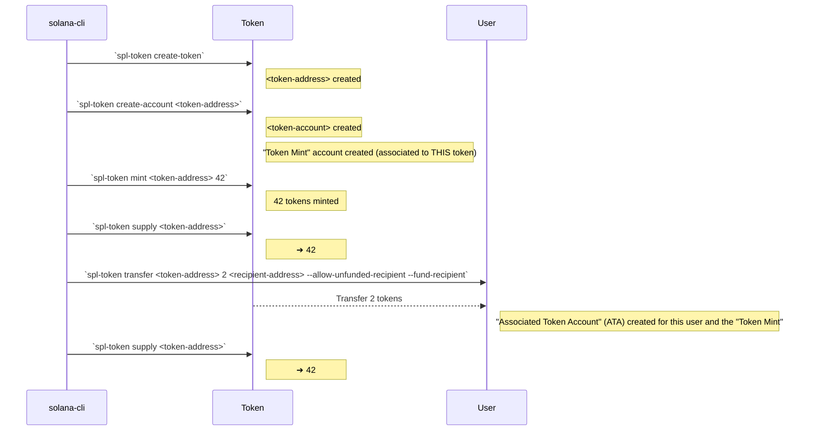

--------

**Résumé:**

1. On imagine une monnaie : `spl-token create-token` (flag `--decimals XX` pour définir le nombre de décimal) ➜ `<token-address>`
2. On crée le compte (coffre ?) pour cette monnaie : `spl-token create-account <token-address>` ➜ `<token-account>`
3. On frappe la monnaie dans une certaine quantité : `spl-token mint <token-address> <amount-to-mint>` en ayant la possibilité de l'attribuer à un compte associé au même type de jeton (c'est-à-dire qu'il doit être lié au même "Token Mint") via `spl-token mint <token-address> <amount-to-mint> <user-token-account>` sinon les jetons seront émis mais resteront dans le "*Token Mint*" jusqu'à ce qu'ils soient attribués à un compte utilisateur à l'aide d'une commande de transfert ou d'une autre méthode d'attribution de jetons.
4. La commande `spl-token supply <token-address>` est utilisée pour interroger le nombre total de jetons en circulation d'un token spécifique ➜ `<token-amount>` nombre total de jetons en circulation.
5. `spl-token accounts` affiche une liste des comptes de jetons SPL associés à une adresse de portefeuille spécifique, en fournissant des détails tels que le type de jeton, le solde du compte, l'identifiant du compte et d'autres informations pertinentes. L'argument `<token-address>` Limite les résultats à un token donné. [Defaut: liste les comptes pour TOUS les tokens]
6. `spl-token transfer <token-address> <amount> <recipient-address> --allow-unfunded-recipient --fund-recipient` est utilisée pour transférer une quantité spécifique de jetons d'un compte à un autre sur la blockchain Solana. Les paramètres spécifient les détails du transfert.
    - `--allow-unfunded-recipient` : Facultatif. Il **permet de transférer des jetons à un destinataire qui n'a pas encore reçu de jetons** sur la blockchain Solana. Cela peut être utile si le destinataire n'a pas encore créé de compte pour le jeton spécifié.
    - `--fund-recipient` : Facultatif. Il indique au programme d'**envoyer** également une **petite quantité de SOL** au destinataire pour couvrir les **frais de transaction**. Nécessaire **si le destinataire n'a pas encore de SOL** sur son compte pour payer les frais de transaction.

--------

**Associated Token Account (ATA)**

> Un "Associated Token Account" (ATA) sur la blockchain Solana est un **compte de portefeuille** qui est **automatiquement associé** à un **compte utilisateur** spécifique et qui est utilisé pour stocker un **type spécifique de jeton** (token).

> Lorsqu'un utilisateur détient des jetons sur Solana, **chaque type de jeton est associé à un compte spécifique appelé "Token Mint"**.

> Lorsqu'un utilisateur souhaite recevoir ou stocker des jetons d'un certain type, **un ATA est automatiquement créé** pour ce compte utilisateur, lié à ce "Token Mint".  

> Cela permet à l'utilisateur de gérer ses jetons de manière transparente sans avoir à créer manuellement des comptes pour chaque type de jeton.

> **En résumé, un ATA est un compte automatiquement créé pour stocker un type spécifique de jeton sur Solana**.

--------

Ce diagramme représente le processus d'un Associated Token Account (ATA) sur la blockchain Solana. Lorsqu'un utilisateur détient des jetons, un ATA est automatiquement associé à son compte utilisateur et utilisé pour stocker les jetons. Chaque ATA est lié à un Token Mint spécifique, qui est le compte associé au type de jeton. L'ATA est automatiquement créé pour l'utilisateur lorsqu'il reçoit ou stocke des jetons, lui permettant de gérer ses jetons de manière transparente.




--------

```bash
❯ solana address
2mcDUMsXbfzeiyr8cNd4XrTp2uwKySC6ujGmCVfBfQ3j


❯ solana balance
3 SOL


❯ solana balance 2mcDUMsXbfzeiyr8cNd4XrTp2uwKySC6ujGmCVfBfQ3j
3 SOL


❯ spl-token create-token --decimals 12
Creating token 8he38TiU21sguZJPhRT2dqjTi929hdfvsGUsVBXMG7Na under program TokenkegQfeZyiNwAJbNbGKPFXCWuBvf9Ss623VQ5DA

Address:  8he38TiU21sguZJPhRT2dqjTi929hdfvsGUsVBXMG7Na
Decimals:  12

Signature: 4Kxdw9YZTXwMMSdrcJEUDqJrkaLGA6h418auxfZzVBYpi7EBCMccT2giqcKVjogjG8ppCqhk867v42yizKTBh24J


❯ spl-token create-account 8he38TiU21sguZJPhRT2dqjTi929hdfvsGUsVBXMG7Na
Creating account 6pJ5LP3SJiNTgtSuZ5juM7aeJsrGTH3E3As5BALU5ZiB

Signature: 3cw2gjwyNeKrYBe17aevqeg2Pea2EAocPrWRrr5sBj8ufHrjhDjYHJCMpVayc5cbDGczje2m99hHawhKPrK2WEvL


❯ spl-token mint 8he38TiU21sguZJPhRT2dqjTi929hdfvsGUsVBXMG7Na 42
Minting 42 tokens
  Token: 8he38TiU21sguZJPhRT2dqjTi929hdfvsGUsVBXMG7Na
  Recipient: 6pJ5LP3SJiNTgtSuZ5juM7aeJsrGTH3E3As5BALU5ZiB

Signature: 3YG7BbzfaxRBZbRcPnjn75vKTLTriPt142RZ7Jmksf4Jt71jc4t2bspHbF3BNPbL6LWzCZhtf16nzq9fmbxKVniB


 ⏱ 4s
❯ spl-token supply 8he38TiU21sguZJPhRT2dqjTi929hdfvsGUsVBXMG7Na
42


❯ spl-token accounts
Token                                         Balance
-----------------------------------------------------
8he38TiU21sguZJPhRT2dqjTi929hdfvsGUsVBXMG7Na  42


❯ spl-token transfer 8he38TiU21sguZJPhRT2dqjTi929hdfvsGUsVBXMG7Na 2 2mcDUMsXbfzeiyr8cNd4XrTp2uwKySC6ujGmCVfBfQ3j --allow-unfunded-recipient --fund-recipient
Transfer 2 tokens
  Sender: 6pJ5LP3SJiNTgtSuZ5juM7aeJsrGTH3E3As5BALU5ZiB
  Recipient: 2mcDUMsXbfzeiyr8cNd4XrTp2uwKySC6ujGmCVfBfQ3j
  Recipient associated token account: 6pJ5LP3SJiNTgtSuZ5juM7aeJsrGTH3E3As5BALU5ZiB

Signature: 2WX1s3e18d7fVghX11mHn81ju57SxCAv6VVPDWZUU2jQjn6y2Xio22gAL5gwHuG91Ezjx6JTiytRWxE9SBQtb8ms


 ⏱ 2s
❯ solana balance
2.99647412 SOL


❯ spl-token supply 8he38TiU21sguZJPhRT2dqjTi929hdfvsGUsVBXMG7Na
42


❯ spl-token accounts
Token                                         Balance
-----------------------------------------------------
8he38TiU21sguZJPhRT2dqjTi929hdfvsGUsVBXMG7Na  42


❯ spl-token accounts 2mcDUMsXbfzeiyr8cNd4XrTp2uwKySC6ujGmCVfBfQ3j
Error: "Could not find mint account 2mcDUMsXbfzeiyr8cNd4XrTp2uwKySC6ujGmCVfBfQ3j"


❯ spl-token display 8he38TiU21sguZJPhRT2dqjTi929hdfvsGUsVBXMG7Na

SPL Token Mint
  Address: 8he38TiU21sguZJPhRT2dqjTi929hdfvsGUsVBXMG7Na
  Program: TokenkegQfeZyiNwAJbNbGKPFXCWuBvf9Ss623VQ5DA
  Supply: 42000000000000
  Decimals: 12
  Mint authority: 2mcDUMsXbfzeiyr8cNd4XrTp2uwKySC6ujGmCVfBfQ3j
  Freeze authority: (not set)


❯ spl-token display 6pJ5LP3SJiNTgtSuZ5juM7aeJsrGTH3E3As5BALU5ZiB

SPL Token Account
  Address: 6pJ5LP3SJiNTgtSuZ5juM7aeJsrGTH3E3As5BALU5ZiB
  Program: TokenkegQfeZyiNwAJbNbGKPFXCWuBvf9Ss623VQ5DA
  Balance: 42
  Decimals: 12
  Mint: 8he38TiU21sguZJPhRT2dqjTi929hdfvsGUsVBXMG7Na
  Owner: 2mcDUMsXbfzeiyr8cNd4XrTp2uwKySC6ujGmCVfBfQ3j
  State: Initialized
  Delegation: (not set)
  Close authority: (not set)


❯ solana account 2mcDUMsXbfzeiyr8cNd4XrTp2uwKySC6ujGmCVfBfQ3j

Public Key: 2mcDUMsXbfzeiyr8cNd4XrTp2uwKySC6ujGmCVfBfQ3j
Balance: 2.99647412 SOL
Owner: 11111111111111111111111111111111
Executable: false
Rent Epoch: 18446744073709551615


❯ solana account 6pJ5LP3SJiNTgtSuZ5juM7aeJsrGTH3E3As5BALU5ZiB

Public Key: 6pJ5LP3SJiNTgtSuZ5juM7aeJsrGTH3E3As5BALU5ZiB
Balance: 0.00203928 SOL
Owner: TokenkegQfeZyiNwAJbNbGKPFXCWuBvf9Ss623VQ5DA
Executable: false
Rent Epoch: 18446744073709551615
Length: 165 (0xa5) bytes
0000:   72 6a eb 1a  d6 a2 a3 03  36 d5 76 ed  3f 47 e8 9d   rj......6.v.?G..
0010:   1a 52 ef c9  32 ba 60 e1  6e 44 1e 47  65 22 ba 93   .R..2.`.nD.Ge"..
0020:   1a 49 0f 6e  f2 3f 3f fc  03 93 a7 c2  9d 4e 10 f3   .I.n.??......N..
0030:   33 bc 45 ad  1c 8a fe 25  45 de 43 63  7a 45 d5 aa   3.E....%E.CczE..
0040:   00 a0 14 e3  32 26 00 00  00 00 00 00  00 00 00 00   ....2&..........
0050:   00 00 00 00  00 00 00 00  00 00 00 00  00 00 00 00   ................
0060:   00 00 00 00  00 00 00 00  00 00 00 00  01 00 00 00   ................
0070:   00 00 00 00  00 00 00 00  00 00 00 00  00 00 00 00   ................
0080:   00 00 00 00  00 00 00 00  00 00 00 00  00 00 00 00   ................
0090:   00 00 00 00  00 00 00 00  00 00 00 00  00 00 00 00   ................
00a0:   00 00 00 00  00                                      .....


❯ solana account 8he38TiU21sguZJPhRT2dqjTi929hdfvsGUsVBXMG7Na

Public Key: 8he38TiU21sguZJPhRT2dqjTi929hdfvsGUsVBXMG7Na
Balance: 0.0014616 SOL
Owner: TokenkegQfeZyiNwAJbNbGKPFXCWuBvf9Ss623VQ5DA
Executable: false
Rent Epoch: 18446744073709551615
Length: 82 (0x52) bytes
0000:   01 00 00 00  1a 49 0f 6e  f2 3f 3f fc  03 93 a7 c2   .....I.n.??.....
0010:   9d 4e 10 f3  33 bc 45 ad  1c 8a fe 25  45 de 43 63   .N..3.E....%E.Cc
0020:   7a 45 d5 aa  00 a0 14 e3  32 26 00 00  0c 01 00 00   zE......2&......
0030:   00 00 00 00  00 00 00 00  00 00 00 00  00 00 00 00   ................
0040:   00 00 00 00  00 00 00 00  00 00 00 00  00 00 00 00   ................
0050:   00 00                                                ..


```

--------

Les différences entre un compte "Token Mint" et un compte "Associated Token Account (ATA)" ont les suivantes :

1. **Token Mint (Compte créateur de Jeton)** :
   - La "Token Mint" est le **compte responsable de l'émission** de nouveaux jetons d'une certaine catégorie sur la blockchain Solana.
   - Elle est **créée lorsqu'un jeton est créé** à l'aide de la commande `spl-token create-token`.
   - Le "Token Mint" détient les informations sur le jeton:
     - Type de jeton
     - Nombre total de jetons en circulation
     - Nombre de décimales
     - etc.
   - Les jetons sont créés et retirés du "Token Mint" en utilisant des commandes spécifiques comme `spl-token mint` et `spl-token burn`.

2. **Associated Token Account (ATA) (Compte Associé de Jeton)** :
   - Un "Associated Token Account" est un **compte de portefeuille** qui est automatiquement associé à un compte utilisateur spécifique sur la blockchain Solana pour stocker un type spécifique de jeton.
   - Il est **créé lorsqu'un utilisateur interagit** avec un certain type de jeton **pour la première fois**, par exemple lorsqu'il reçoit des jetons ou qu'il effectue une transaction avec eux.
   - Chaque ATA est associé à un "Token Mint" spécifique, ce qui signifie qu'il est **destiné à stocker uniquement** les jetons de **ce "Token Mint"**.
   - Les ATAs sont utilisés pour **suivre la possession et le transfert** de jetons par les utilisateurs sur la blockchain Solana.

--------

**Solana CLI (`solana`):**
- `solana balance <adresse>` : Vérifie le solde d'un compte.
- `solana transfer <montant> <adresse destinataire>` : Transfère des SOL à une autre adresse.
- `solana airdrop <montant>` : Obtient des SOL gratuits sur un compte.
- `solana account <adresse>` : Affiche les informations sur un compte.
- `solana config get` : Affiche les paramètres de configuration actuels.
- `solana config set` : Configure les paramètres de configuration.
- `solana program deploy` : Déploie un programme sur la blockchain Solana.
- `solana program logs` : Affiche les journaux d'exécution d'un programme.

**SPL Token CLI (`spl-token`):**
- `spl-token create-token` : Crée un nouveau jeton.
- `spl-token mint <montant> <adresse>` : Crée de nouveaux jetons et les attribue à une adresse.
- `spl-token transfer <adresse source> <montant> <adresse destination>` : Transfère des jetons entre adresses.
- `spl-token approve <adresse dépensière> <montant>` : Approuve une adresse pour dépenser des jetons.
- `spl-token account <adresse>` : Affiche les informations sur un compte de jetons.

--------

- [**Solana CLI Reference and Usage**](https://docs.solanalabs.com/cli/usage)
- [**Understanding Solana’s Mint Accounts and Token Accounts**](https://medium.com/@jorge_londono_31005/understanding-solanas-mint-account-and-token-accounts-546c0590e8e)

--------


```bash
mkdir ts-token-solana  && cd ts-token-solana && npm init -y && tsc --init && mkdir src && touch src/main.ts
```
```bash
npm install \
    @metaplex-foundation/umi \
    @metaplex-foundation/umi-bundle-defaults \
    @metaplex-foundation/mpl-token-metadata \
    @solana/web3.js \ 
    @types/node \
```
